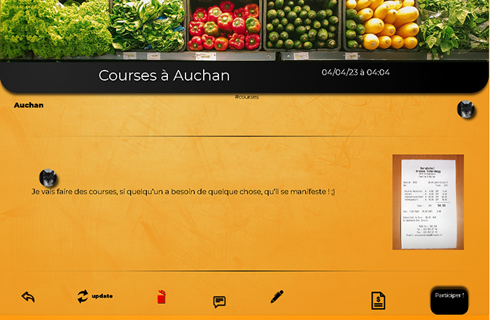

# Voisins

## Préambule
Vivant en semi-communauté avec mes voisins et en période de confinement, j'ai créé cette appli  pour faciliter l'organisation d'événéments entre nous ( d'où le nom très recherché de "voisins"). Sachant qu'elle peut être utile à tout le monde et à tout moment j'ai décidé de partager le dépôt publiquement.
Bien que le projet soit toujours en cours d'évolution, l'appli est déjà utilisable.

## Fonctionnalités
L'appli permet de créer plusieurs sortes d'événements, que ce soit des courses, des repas, des apéros, des services... à des dates précises. Elle permet aussi de s'inscrire à des événements, créer des requêtes de listes de courses et partager des commentaires sur les événements. 

Il est possible aussi d'uploader des factures, tickets de caisse ou autres sous forme de photos directement dans la page de listes de courses.

## Installation

Je n'accepte pas de pull request pour le moment mais libre à vous de fork le projet et d'en faire ce que vous voulez !

---

Enjoy !